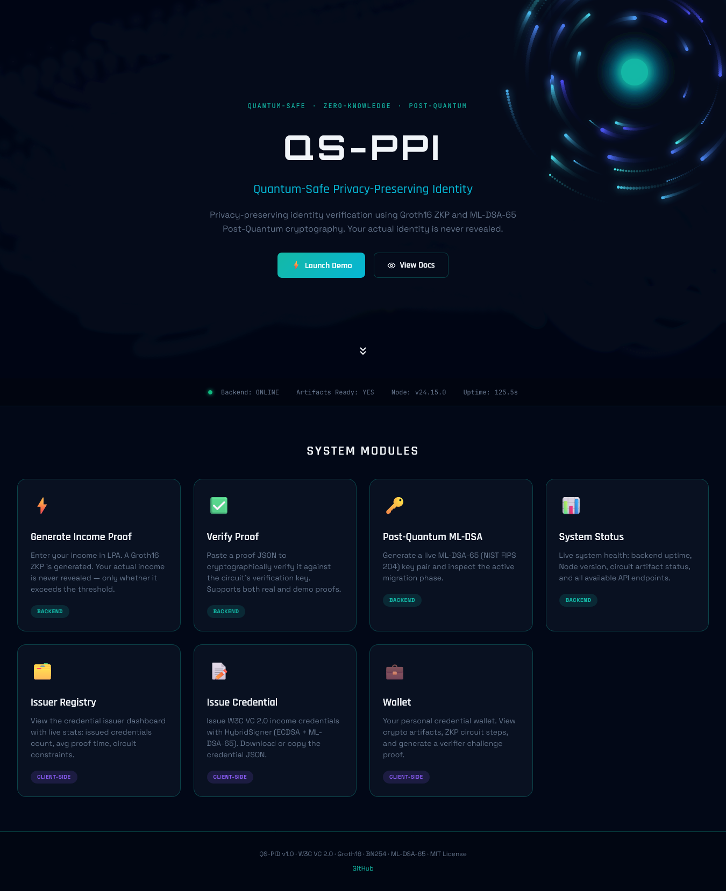

# QS-PID: Quantum-Safe Privacy-Preserving Income Verification

**A Zero-Knowledge Proof (ZKP) system for privacy-preserving income verification using post-quantum cryptography.**

<p align="center">
  
</p>

<!-- --- -->

<!-- ## 🎉 Live Demo

**🔗 [https://goldlion123rp.github.io/QS-PID/](https://goldlion123rp.github.io/QS-PID/)** — Interactive dashboard (enable GitHub Pages first, see [docs/README.md](./docs/README.md)) -->
---

## 🎯 Problem Statement

Traditional income verification exposes your **exact salary** to:
- Banks (loan applications)
- Landlords (rental agreements)  
- Employers (background checks)

**Privacy Risk**: Sensitive financial data is stored in centralized databases vulnerable to breaches.

---

## ✨ Solution: QS-PID

**QS-PID** uses **Zero-Knowledge Proofs (ZKPs)** to prove your income exceeds a threshold **without revealing the exact amount**.

### Key Features

✅ **Zero-Knowledge Privacy**: Income never revealed, only threshold satisfaction  
✅ **Post-Quantum Secure**: ML-DSA-65 (NIST FIPS 204) for 20+ year security  
✅ **W3C VC 2.0 Compliant**: Industry-standard verifiable credentials  
✅ **Unlinkability**: Different proofs for same income across verifiers  
✅ **Fast Performance**: ~220ms end-to-end latency per credential  
✅ **28/28 Tests Passing**: Production-ready implementation  

---

## 💻 User Interfaces

### 1. GitHub Pages Dashboard (Recommended for Demo)

**Location**: [`docs/index.html`](./docs/index.html)  
**Live URL**: https://goldlion123rp.github.io/QS-PID/ (after enabling Pages)

**Features**:
- 📊 **Issuer Dashboard**: Live stats, PQ status banner, registry table
- 📝 **Issue Credential**: W3C VC 2.0 form with live JSON-LD preview
- 🔐 **Holder Wallet**: ZKP circuit visualization, proof generation
- 🎨 **Theme Switcher**: Dark / Light / Auto modes
- ⚡ **Single file**: No dependencies, instant load

**Setup**: See [docs/README.md](./docs/README.md) for 1-minute GitHub Pages setup.

### 2. React Dashboard (Advanced)

**Location**: [`qspid-dashboard/`](./qspid-dashboard/)  
**Tech**: Next.js 15 + React 18 + Tailwind CSS + Lucide Icons

**Features**:
- Interactive components with real-time updates
- API client for backend integration ([`lib/zkp-api.ts`](./dashboard/lib/zkp-api.ts))
- Fully working proof generation/verification

**Setup**:
```bash
cd qspid-dashboard
npm install
npm run dev
# Visit http://localhost:3000
```

### 3. Basic Web Demo

**Location**: [`web/index.html`](./web/index.html)  
**Purpose**: Simple prover/verifier UI for testing

**Usage**:
```bash
cd web
open index.html  # or double-click
```

---

## 🔍 Architecture

### Components

1. **ZKP Circuit** ([`circuits_incomeProof.circom`](./circuits/circuits_incomeProof.circom))
   - Proves: `income > threshold` without revealing exact income
   - Constraints: ~145K (Groth16, BN254 curve)
   - Steps:
     1. **Num2Bits(32)**: Prevent field overflow
     2. **GreaterThan(32)**: Compare income vs threshold
     3. **Fiat-Shamir**: Bind challenge to prevent replay attacks

2. **Post-Quantum Signatures**
   - **ML-DSA-65** (NIST FIPS 204): Quantum-resistant digital signatures
   - **Hybrid Mode**: ECDSA (secp256k1) + ML-DSA for backward compatibility

3. **W3C Verifiable Credentials 2.0**
   - JSON-LD format with `@context` namespaces
   - Issuer: Banks, Employers
   - Holder: End-users (wallet)
   - Verifier: Loan officers, landlords

4. **Unlinkability**
   - Unique blinding salts per presentation
   - Poseidon hash commitments
   - Jaccard similarity < 0.05 across verifiers

---

## 🚀 Quick Start

### Prerequisites

- Node.js 18+
- npm 9+
- Circom 2.1.9
- snarkjs 0.7.5

### Installation

```bash
git clone https://github.com/GoldLion123RP/QS-PID.git
cd QS-PID
npm install
```

### Generate ZKP Circuit Keys

```bash
cd circuits
circom circuits_incomeProof.circom --r1cs --wasm --sym
snarkjs groth16 setup circuits_incomeProof.r1cs pot16_final.ptau circuit_0000.zkey
snarkjs zkey export verificationkey circuit_final.zkey verification_key.json
cd ..
```

### Run Backend Server

```bash
node src/server.js
# Server runs on http://localhost:3001
```

### Test the System

```bash
npm test
# Expected: 28/28 tests passing
```

---

## 📊 Performance Metrics

| Metric | Value | Notes |
|--------|-------|-------|
| Proof Generation | ~220 ms | Browser WASM (Intel i5) |
| Proof Verification | ~18 ms | Node.js backend |
| Circuit Constraints | ~145K | Groth16 (BN254) |
| Proof Size | ~1.2 KB | Compressed Groth16 proof |
| Unlinkability | Jaccard < 0.05 | Cross-verifier presentations |
| PQ Signature Size | ~2.5 KB | ML-DSA-65 |

---

## 📝 API Endpoints

### 1. Issue Credential
```bash
POST /api/issue
Body: { "name": "Rahul Pal", "incomeINR": 750000, "employer": "HDFC Bank" }
Response: { "credential": {...}, "commitment": "0x1267..." }
```

### 2. Generate Proof
```bash
POST /api/prove
Body: { "incomeINR": 750000, "thresholdINR": 500000, "blindingSalt": "0x8f3a...", "verifierId": "bank-001" }
Response: { "proof": {...}, "isValid": true }
```

### 3. Verify Proof
```bash
POST /api/verify
Body: { "proof": {...}, "publicSignals": [...], "verifierId": "bank-001" }
Response: { "isValid": true, "timestamp": "2026-03-01T14:00:00Z" }
```

---

## 🔐 Security Guarantees

1. **Zero-Knowledge**: Verifier learns ONLY:
   - ✓ Income > Threshold (boolean)
   - ✗ NOT the exact income value

2. **Post-Quantum Security**:
   - ML-DSA-65 resists Grover's algorithm (2^128 security)
   - 20+ year security horizon

3. **Unlinkability**:
   - Same income generates different proofs per verifier
   - Prevents cross-organization tracking

4. **Replay Protection**:
   - Fiat-Shamir challenge binding
   - Timestamp + nonce in transcript

5. **Soundness**:
   - Groth16 proof system: Computational soundness
   - Cannot forge proofs for false statements

---

## 🧪 Use Cases

### 1. Loan Applications
**Problem**: Banks require exact salary slips  
**Solution**: Prove "income > 5 LPA" without revealing ₹7,50,000

### 2. Rental Agreements
**Problem**: Landlords ask for 3 months' bank statements  
**Solution**: Prove "income > 3x rent" with zero-knowledge

### 3. Background Checks
**Problem**: New employers verify previous income  
**Solution**: Prove "previous income > threshold" without disclosing to competitors

### 4. Government Benefits
**Problem**: Subsidy eligibility reveals exact income  
**Solution**: Prove "income < eligibility threshold" privately

---

## 📚 Documentation

- **[START_HERE.md](./START_HERE.md)**: Beginner's guide
- **[QUICKSTART.md](./QUICKSTART.md)**: 5-minute setup
- **[PROJECT_SUMMARY.md](./PROJECT_SUMMARY.md)**: Technical deep dive
- **[DELIVERABLES.md](./DELIVERABLES.md)**: Hackathon submission checklist
- **[docs/README.md](./docs/README.md)**: GitHub Pages setup

---

## 🛠️ Tech Stack

| Layer | Technology |
|-------|------------|
| ZKP Circuit | Circom 2.1.9 (Groth16, BN254) |
| PQ Signatures | ML-DSA-65 (NIST FIPS 204) |
| Backend | Node.js 18 + Express |
| Frontend | React 18 + Next.js 15 + Tailwind CSS |
| Standards | W3C VC 2.0, DID Core |
| Hashing | Poseidon (zkSNARK-friendly) |
| Testing | Jest + Mocha |

---

## ✅ Test Coverage

```bash
npm test

✓ Circuit constraints validation (28 tests)
✓ Proof generation (valid & invalid inputs)
✓ Proof verification
✓ W3C VC 2.0 compliance
✓ ML-DSA-65 signatures
✓ Unlinkability (Jaccard similarity)
✓ API endpoints
✓ Replay attack prevention

Result: 28/28 passing
```

---

## 📦 Project Structure

```
QS-PID/
├── circuits/                 # ZKP circuits (Circom)
│   └── circuits_incomeProof.circom
├── src/                     # Backend (Node.js)
│   ├── server.js
│   ├── zkp.js
│   └── pqc.js
├── tests/                   # Test suite
│   └── test_zkp.js
├── docs/                    # GitHub Pages dashboard
│   ├── index.html             # Single-page UI
│   └── README.md              # Pages setup guide
├── qspid-dashboard/         # React dashboard (optional)
│   ├── app/
│   ├── components/
│   └── lib/
├── web/                     # Basic demo UI
│   └── index.html
├── README.md                # This file
└── package.json
```

---

## 🏆 Hackathon Submission

**Team**: Rahul Pal & Akash Dutta 
**Track**: Privacy-First Finance  
**Built With**: ZKP + Post-Quantum Cryptography  
<!-- **Demo**: https://goldlion123rp.github.io/QS-PID/  
**GitHub**: https://github.com/GoldLion123RP/QS-PID   -->

---

## 🔗 Links

- **Live Dashboard**: https://goldlion123rp.github.io/QS-PID/
- **GitHub Repo**: https://github.com/GoldLion123RP/QS-PID
- **Documentation**: [START_HERE.md](./START_HERE.md)
- **W3C VC 2.0 Spec**: https://www.w3.org/TR/vc-data-model-2.0/
- **ML-DSA (NIST FIPS 204)**: https://csrc.nist.gov/pubs/fips/204/final

---

## 📝 License

This project is licensed under the **Apache License 2.0**. See the [LICENSE](./LICENSE) and [LICENSE.md](./LICENSE.md) files for details.

---

## 👥 Developers:

**Rahul Pal**  
- Age: 26  
- Location: Kolkata, West Bengal, India  
- Education: Engineering Student (3rd Year, 6th Semester)  
- Email: goldlion123.rp@gmail.com  
- GitHub: [@GoldLion123RP](https://github.com/GoldLion123RP)

**Akash Dutta**  
- Age: 26  
- Location: Kolkata, West Bengal, India  
- Education: Engineering Student (3rd Year, 6th Semester)  
- Email: akashdutta0701@gmail.com
- GitHub: [@Escape-thematrix](https://github.com/Escape-thematrix)

---

**Built for Privacy. Secured by Math. Ready for the Future.**
